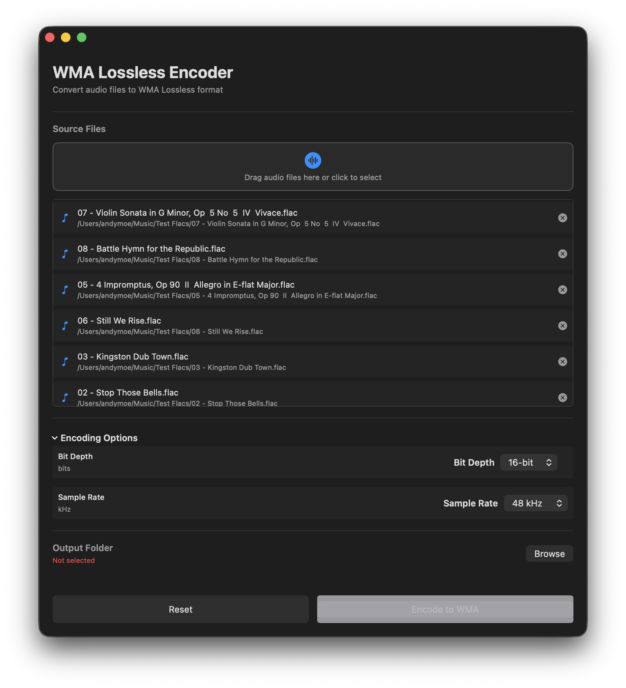

# WMA Lossless Encoder

A macOS application for encoding audio files to WMA Lossless format.

## Features

- Drag and drop file selection
- Supports MP3, WAV, AIFF, FLAC, and other audio formats
- Recursive folder scanning
- File type filtering
- Three output location modes:
  - Custom folder
  - Same directory as input files
  - Subfolder within input file directories
- Configurable encoding options:
  - Auto mode: matches input file properties (bit depth and sample rate)
  - Manual mode: 16-bit or 24-bit depth, 44.1/48/96 kHz sample rate
- Batch encoding with parallel processing (up to 4 concurrent files)
- Per-file encoding status with visual indicators
- Uses [WMA Lossless encoder for FFmpeg](https://github.com/magicisinthehole/FFmpeg-with-WMA-Lossless-Enc/tree/wma-lossless-encoder)

## Screenshot



## System Requirements

- macOS 12.0 or later
- Apple Silicon (arm64) or Intel (x86_64) processor

## Installation

### From Release

1. Download the DMG from [releases](https://github.com/magicisinthehole/WMALMAC/releases)
2. Drag WMAEncoder.app to your Applications folder
3. Launch the application

### Building from Source

#### Requirements
- macOS 12.0 or later
- Xcode 13.0 or later
- Git
- Standard build tools (make, etc.)

#### Building FFmpeg

1. Clone the WMA Lossless FFmpeg fork:
   ```bash
   git clone https://github.com/magicisinthehole/FFmpeg-with-WMA-Lossless-Enc.git -b wma-lossless-encoder FFmpeg
   cd FFmpeg
   ```

2. Configure and build FFmpeg for your native architecture:
   ```bash
   MACOSX_DEPLOYMENT_TARGET=12.0 ./configure \
     --enable-gpl \
     --disable-libxcb --disable-libxcb-shm --disable-libxcb-xfixes --disable-libxcb-shape \
     --disable-xlib \
     --disable-autodetect \
     --extra-cflags="-mmacosx-version-min=12.0" \
     --extra-ldflags="-mmacosx-version-min=12.0"
   make -j$(sysctl -n hw.ncpu)
   ```

3. Copy the binaries:
   ```bash
   cp ffmpeg <path-to-WMAEncoder>/WMAEncoder/Resources/
   cp ffprobe <path-to-WMAEncoder>/WMAEncoder/Resources/
   ```

##### Optional: Universal binary (arm64 + x86_64)

The bundled binaries shipped in the official release are universal. To build a universal binary yourself, do two out-of-tree builds and combine them with `lipo`:

```bash
mkdir build_arm64 build_x86_64

(cd build_arm64 && MACOSX_DEPLOYMENT_TARGET=12.0 ../configure \
  --enable-gpl --disable-libxcb --disable-libxcb-shm --disable-libxcb-xfixes \
  --disable-libxcb-shape --disable-xlib --disable-autodetect \
  --arch=arm64 --target-os=darwin --cc='clang -arch arm64' \
  --extra-cflags='-mmacosx-version-min=12.0 -arch arm64' \
  --extra-ldflags='-mmacosx-version-min=12.0 -arch arm64' \
  && make -j$(sysctl -n hw.ncpu) ffmpeg ffprobe)

(cd build_x86_64 && MACOSX_DEPLOYMENT_TARGET=12.0 ../configure \
  --enable-gpl --disable-libxcb --disable-libxcb-shm --disable-libxcb-xfixes \
  --disable-libxcb-shape --disable-xlib --disable-autodetect \
  --enable-cross-compile --arch=x86_64 --target-os=darwin --cc='clang -arch x86_64' \
  --extra-cflags='-mmacosx-version-min=12.0 -arch x86_64' \
  --extra-ldflags='-mmacosx-version-min=12.0 -arch x86_64' \
  && make -j$(sysctl -n hw.ncpu) ffmpeg ffprobe)

lipo -create -output ffmpeg  build_arm64/ffmpeg  build_x86_64/ffmpeg
lipo -create -output ffprobe build_arm64/ffprobe build_x86_64/ffprobe
```

#### Building the Application

1. Clone this repository:
   ```bash
   git clone https://github.com/magicisinthehole/WMALMAC.git
   cd WMALMAC/WMAEncoder
   ```

2. Open the project in Xcode:
   ```bash
   open WMAEncoder.xcodeproj
   ```

3. Build and run:
   - Select the WMAEncoder scheme
   - Build (Cmd+B) or Run (Cmd+R)
   - No code signing certificate is required to build and run locally

## Usage

1. **Add Files**
   - Drag audio files or folders into the drop zone or click to browse
   - When selecting folders, all audio files in subdirectories are automatically added
   - Use the file type filter to view specific formats

2. **Set Encoding Options** (optional)
   - Expand "Encoding Options" to select encoding mode:
     - Auto: matches each file's original properties (default: 16-bit, 48 kHz)
     - Manual: specify bit depth (16-bit or 24-bit) and sample rate (44.1/48/96 kHz)

3. **Select Output Location**
   - Choose output mode:
     - Custom Folder: select a specific directory
     - Same as Input: files are saved alongside originals
     - Subfolder in Input: files are saved in a subfolder (configurable name)

4. **Encode**
   - Click "Encode to WMA" to start
   - Up to 4 files encode simultaneously
   - Progress indicators show encoding status for each file
   - Green checkmark appears when each file completes

## Troubleshooting

**"Permission denied" errors**
- Check that the input and output folders are readable/writable

**Encoding fails**
- Verify the audio files are in a supported format
- Ensure the output directory is writable

**Application won't launch**
- Requires macOS 12.0 or later

## Technical Details

- Built with SwiftUI
- Bundled with [WMA Lossless encoder for FFmpeg](https://github.com/magicisinthehole/FFmpeg-with-WMA-Lossless-Enc/tree/wma-lossless-encoder)
- Bundled `ffmpeg` and `ffprobe` are universal binaries (arm64 + x86_64), Developer-ID signed with hardened runtime
- Encoding runs locally

## License

Uses FFmpeg under GPL/LGPL licenses. The included FFmpeg binary is compiled with GPL support.
