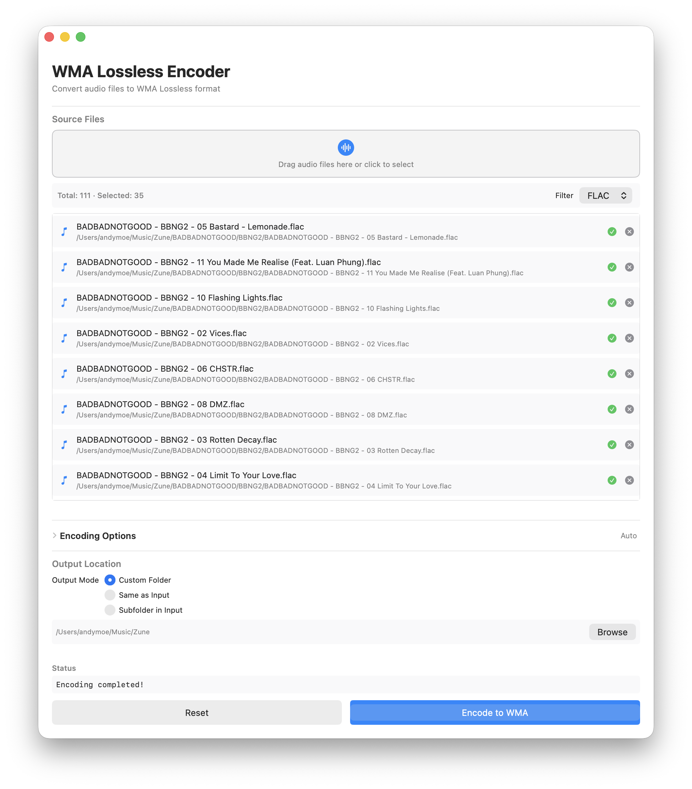

# WMA Lossless Encoder

A macOS application for encoding audio files to WMA Lossless format.

## Features

- Drag and drop file selection
- Supports MP3, WAV, AIFF, FLAC, and other audio formats
- Configurable encoding options:
  - Bit Depth: 16-bit or 24-bit
  - Sample Rate: 44.1 kHz, 48 kHz, or 96 kHz
- Batch encoding of multiple files
- Encoding progress display
- Uses [WMA Lossless encoder for FFmpeg](https://github.com/magicisinthehole/FFmpeg/tree/wma-lossless-encoder)

## Screenshot

## System Requirements

- macOS 12.0 or later
- Apple Silicon (arm64) or Intel (x86_64) processor

## Installation

1. Download the DMG from releases
2. Drag WMAEncoder.app to your Applications folder
3. Launch the application

## Usage

1. **Add Files**
   - Drag audio files into the drop zone or click to browse

2. **Set Options** (optional)
   - Expand "Encoding Options" to change bit depth (default: 16-bit) or sample rate (default: 48 kHz)

3. **Select Output Folder**
   - Click "Browse" to choose where to save encoded files

4. **Encode**
   - Click "Encode to WMA" to start
   - Encoded files are saved with .wma extension

## Troubleshooting

**"Permission denied" errors**
- Check that the input and output folders are readable/writable

**Encoding fails**
- Verify the audio files are in a supported format
- Ensure the output directory is writable

**Application won't launch**
- Requires macOS 12.0 or later

## Technical Details

- Built with SwiftUI
- Bundled with [WMA Lossless encoder for FFmpeg](https://github.com/magicisinthehole/FFmpeg/tree/wma-lossless-encoder)
- Encoding runs locally

## License

Uses FFmpeg under GPL/LGPL licenses. The included FFmpeg binary is compiled with GPL support.
